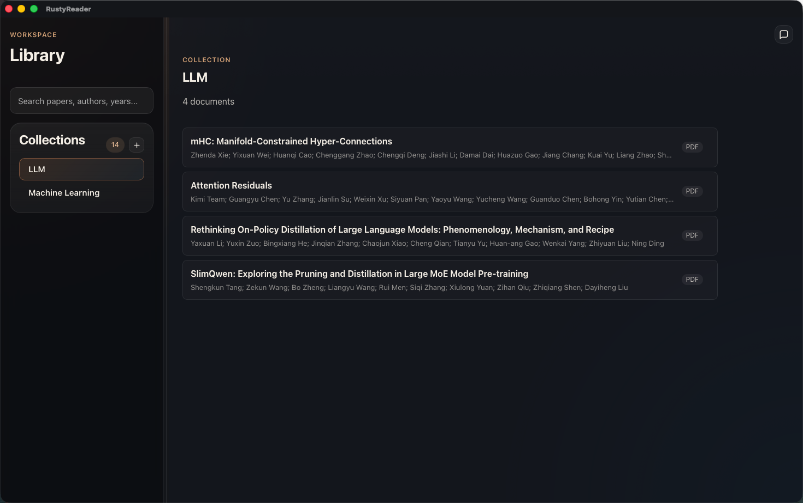
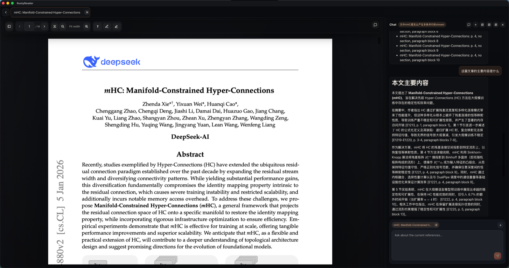

# RustyReader

<div align="center">

**本地优先的桌面论文工作台：阅读、管理、标注、AI 综述，一处完成。**

**简体中文** · [English](README.md)

[](https://tauri.app/)
[](https://react.dev/)
[](https://www.typescriptlang.org/)
[](https://www.rust-lang.org/)
[](https://www.sqlite.org/)


[下载](#下载) · [截图](#截图) · [功能](#功能) · [快速开始](#快速开始) · [浏览器插件](#浏览器插件) · [架构](#架构) · [开发](#开发)

</div>

---

## 概览

RustyReader 是一个面向论文阅读和研究整理的原生桌面工作台。它围绕本地资料库、专注阅读器和 AI 研究助手构建，可导入论文和引用记录，把元数据与笔记保存在 SQLite 本地资料库中，并帮助你把阅读过程沉淀为可复用的研究产出。

## 截图





## 功能

| 模块 | 说明 |
| --- | --- |
| 资料库 | 层级集合、标签、元数据编辑、搜索和批量操作 |
| 阅读 | PDF 专注模式、连续阅读、缩放、页码跳转和文内搜索 |
| 标注 | PDF 高亮、文本框标注、稳定锚点和划词操作 |
| AI | 支持单篇论文、集合和 session 级研究任务 |
| 笔记 | 将 AI 输出和选区保存为可编辑 Markdown 笔记 |
| OCR | 对缺少可用文本层的 PDF 提供 Tesseract OCR 兜底 |
| 浏览器采集 | 通过 Chrome 与 Safari 插件保存 PDF 和可读网页 |

## 工作流

1. 将 `PDF`、`DOCX`、`EPUB` 或引用记录导入本地资料库。
2. 用层级集合组织论文，并补充标签与元数据。
3. 在桌面阅读器中阅读、标注重点内容并保存笔记。
4. 围绕单篇论文、集合或整理好的 session 向 AI 提问。
5. 直接从 Chrome 或 Safari 采集新的 PDF 与可读网页。

## 下载

下载最新版 macOS Apple Silicon 桌面应用和浏览器插件：

| 包 | 下载 | 用途 |
| --- | --- | --- |
| 桌面应用 | [RustyReader v0.1.0 DMG](https://github.com/Playitcooool/rust-ai-paper-reader/releases/download/v0.1.0/RustyReader_0.1.0_aarch64.dmg) | 安装 RustyReader 桌面应用 |
| Chrome 插件 | [RustyReader Chrome Extension v0.1.0 ZIP](https://github.com/Playitcooool/rust-ai-paper-reader/releases/download/v0.1.0/rustyreader-connector-v0.1.0.zip) | 通过 Chrome 开发者模式加载连接器 |
| Safari 插件 | [RustyReader Safari Temporary Extension ZIP](https://github.com/Playitcooool/rust-ai-paper-reader/releases/download/v0.1.0/rustyreader-safari-temporary-extension.zip) | 通过 Safari 开发者设置快速本地导入 |

使用任一浏览器插件时，请保持桌面应用运行。

## 快速开始

### 环境要求

- `Node.js 18+`
- `npm`
- Rust 工具链
- 当前平台所需的 Tauri v2 前置依赖
- 如果需要打包 Safari 插件，还需要完整 Xcode

### 安装依赖

```bash
npm install
```

### 运行桌面应用

```bash
npm run tauri:dev
```

桌面应用会启动浏览器插件使用的本地连接器：

```text
http://127.0.0.1:17654
```

### 构建

```bash
npm run build
npm run tauri:build
```

## 浏览器插件

RustyReader 提供浏览器连接器，可将论文和可读网页保存到桌面资料库。使用插件时请保持 RustyReader 运行，确保本地连接器可用。

### 插件可以导入什么

- 直接的 `PDF`、`DOCX` 和 `EPUB` 链接
- 当前打开的 PDF 或文档标签页
- 转换为 Markdown 快照的可读网页
- 通过右键菜单 `Save to RustyReader` 保存文件链接

插件弹窗会加载 RustyReader 集合，允许你选择目标集合，扫描当前标签页，并把导入请求发送到本地桌面连接器。

### Chrome 插件

使用已下载的 Chrome 插件压缩包：

1. 下载 [RustyReader Chrome Extension v0.1.0 ZIP](https://github.com/Playitcooool/rust-ai-paper-reader/releases/download/v0.1.0/rustyreader-connector-v0.1.0.zip)。
2. 解压到本地文件夹。
3. 启动已安装的 RustyReader 桌面应用。
4. 打开 `chrome://extensions`。
5. 启用 `Developer mode`。
6. 点击 `Load unpacked`。
7. 选择解压后的 `rustyreader-connector` 文件夹。
8. 固定或打开 `RustyReader` 插件。
9. 选择集合，并点击弹窗中显示的导入操作。

从仓库本地构建：

```bash
npm run extension:package
```

本地输出：

```text
extensions/chrome/dist/rustyreader-connector
extensions/chrome/dist/rustyreader-connector-v0.1.0.zip
```

在 Chrome 中加载本地构建：

1. 使用 `npm run tauri:dev` 启动 RustyReader，或打开已构建的桌面应用。
2. 打开 `chrome://extensions`。
3. 启用 `Developer mode`。
4. 点击 `Load unpacked`。
5. 选择 `extensions/chrome/dist/rustyreader-connector`。
6. 固定或打开 `RustyReader` 插件。
7. 选择集合，并点击弹窗中显示的导入操作。

Chrome 使用说明：

- 集合加载后，弹窗会扫描当前活动标签页。
- 如果页面内容发生变化，可以再次点击 `Scan Page`。
- 右键点击直接文档链接，选择 `Save to RustyReader`，即可导入到上次选择的集合。
- 当前桌面应用使用 `http://127.0.0.1:17654`，不需要手动配置 token。

### Safari 插件

日常本地使用请安装持久 Safari Web Extension App：

```bash
npm run extension:safari:install
```

该命令会构建并安装 `/Applications/RustyReader Safari.app`，然后打开它，让 Safari 注册插件。接着在 Safari 中打开 `Settings` -> `Extensions`，启用 `RustyReader`，再打开插件弹窗，选择集合并导入当前页面或文档。

临时 Safari 插件只适合快速测试。Safari 会在 24 小时后或退出 Safari 时移除临时插件。

如果仍需要使用已下载的 Safari 临时插件压缩包：

1. 下载 [RustyReader Safari Temporary Extension ZIP](https://github.com/Playitcooool/rust-ai-paper-reader/releases/download/v0.1.0/rustyreader-safari-temporary-extension.zip)。
2. 启动已安装的 RustyReader 桌面应用。
3. 在 Safari 中打开 `Settings` -> `Developer` -> `Add Temporary Extension...`。
4. 选择下载的 `rustyreader-safari-temporary-extension.zip`。
5. 打开 `Settings` -> `Extensions`。
6. 启用 `RustyReader`。
7. 打开插件弹窗，选择集合，并导入当前页面或文档。

Safari 打包需要完整 Xcode，而不仅是 Command Line Tools。请确认已选择 Xcode：

```bash
sudo xcode-select -s /Applications/Xcode.app/Contents/Developer
```

构建 Safari Web Extension 输入目录：

```bash
npm run extension:safari:build
```

生成可从 Developer 设置加载的本地测试压缩包：

```bash
npm run extension:safari:zip
```

打包为 Safari Web Extension App：

```bash
npm run extension:safari:package
```

构建并持久安装：

```bash
npm run extension:safari:install
```

输出：

```text
extensions/safari/build/extension
extensions/safari/dist/rustyreader-safari-temporary-extension.zip
extensions/safari/build/RustyReaderSafari
/Applications/RustyReader Safari.app
```

在 Safari 中运行并启用持久开发版本：

1. 使用 `npm run tauri:dev` 启动 RustyReader，或打开已构建的桌面应用。
2. 在 Xcode 中打开 `extensions/safari/build/RustyReaderSafari`。
3. 构建并运行生成的应用。
4. 在 Safari 中打开 `Settings` -> `Extensions`。
5. 启用 `RustyReader`。
6. 打开插件弹窗，选择集合，并导入当前页面或文档。

如果使用临时压缩包流程，打开 Safari `Settings` -> `Developer` -> `Add Temporary Extension...`，选择 `extensions/safari/dist/rustyreader-safari-temporary-extension.zip`，再从 `Settings` -> `Extensions` 启用。Safari 会在 24 小时后或退出 Safari 时移除临时插件。

Safari 使用说明：

- Safari 不提供 Chrome 的 `downloads` API，因此文件导入会在插件后台抓取文件并上传到 `POST /v1/import-file`。
- Safari manifest 包含较宽的 `http` 和 `https` 主机权限，以便插件抓取选中的文档 URL。
- 如果插件无法连接，请确认桌面应用正在运行，并检查连接器健康接口 `http://127.0.0.1:17654/v1/health` 是否可访问。

### 插件命令

```bash
npm run extension:test
npm run extension:smoke
npm run extension:package
npm run extension:safari:build
npm run extension:safari:zip
npm run extension:safari:package
```

实现细节见 [extensions/chrome/README.md](extensions/chrome/README.md)、[extensions/safari/README.md](extensions/safari/README.md) 和 [extensions/chrome/docs/rustyreader-connector-api.md](extensions/chrome/docs/rustyreader-connector-api.md)。

## 架构

```text
RustyReader
├─ Tauri v2 桌面壳
├─ React + TypeScript 前端
│  ├─ 资料库工作区
│  ├─ PDF 与标准化文档阅读器
│  ├─ 标注与搜索界面
│  └─ AI session 与笔记
├─ Rust 后端
│  ├─ app-core 领域服务
│  ├─ SQLite 资料库存储
│  ├─ PDF 渲染与 OCR 辅助能力
│  ├─ 安全的 provider 设置
│  └─ localhost 浏览器连接器
└─ 浏览器插件
   ├─ Chrome MV3 连接器
   └─ Safari Web Extension App
```

### 技术栈

- 桌面：`Tauri v2`
- 前端：`React 18`、`TypeScript`、`Vite`
- 后端：包含 `crates/app-core` 的 Rust workspace
- 存储：`SQLite` 与托管本地文件
- PDF：`pdf.js` 加原生后端辅助能力
- OCR：`Tesseract`
- Markdown：`react-markdown` 与 `remark-gfm`
- 测试：`Vitest`、Testing Library 和 Rust tests

## 项目结构

```text
src/                    React 应用、hooks 与 UI 状态
src/components/         阅读器、工作区、侧边栏、AI 与设置组件
src/lib/                运行时 API contract 与浏览器辅助代码
src-tauri/              Tauri 壳、原生命令、连接器和应用配置
crates/app-core/        资料库、导入、AI、笔记、搜索和存储服务
extensions/chrome/      Chrome MV3 RustyReader 插件
extensions/safari/      Safari Web Extension 打包
docs/                   项目辅助文档
```

## 开发

运行主要检查：

```bash
npm test
npm run build
cargo test
```

运行完整项目验证脚本：

```bash
npm run verify
```

运行浏览器插件检查：

```bash
npm run extension:test
npm run extension:smoke
```

## 当前状态

RustyReader 已支持核心桌面研究闭环：

- 本地资料库管理
- 多格式导入与阅读
- PDF 高亮与标注工具
- 全文搜索与文内搜索
- AI 辅助研究 session
- Markdown 研究笔记
- Chrome 与 Safari 浏览器采集
- 安全的 provider 配置

项目仍在持续演进，重点包括打包、首次使用体验、阅读器细节和更深入的研究工作流。

## 许可证

MIT
